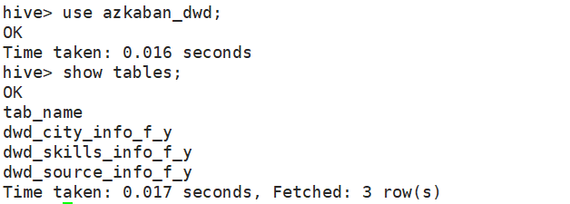

# Azkaban调度Hive实操

> Author: Amos_Liu
> Date: 2023.12.27

## 0. 命途多舛

> 指几乎遇到了所有能遇到的报错

### 看似对了，实则不对


* 笔者这里想将每个sql文件封装到不同的job文件中，然后用flow文件进行统一调度
  * 查看日志结果，报出：`Command: hive -e "DROP TABLE IF EXISTS dws_company_info_f_y;`说明无论是否加引号, job里的文件都无法支持换行操作
  * 笔者只得作罢, 将sql文件重写从job中提取出来写入sql文件中并上传至Linux虚拟机中

### 报错一


* 运行Azkaban任务报错:  `java.lang.IllegalStateException: Process has not yet started`
  * 报错原因: 部署Azkaban时部署为多执行器模式，那么在这种模式下Azkaban web Server会根据策略，选取其中一个Executor取执行任务，而脚本文件只在主节点上有，所以要进行修改。
  * 解决: 推荐使用指定特定的Executor取执行任务
    * 1. 在MySQL中azkaban数据库executors表中，查询应用所在节点上的Executor的id。
    
    * 2. 在执行工作流程时加入useExecutor属性。
    
    * 3. 启动执行

  * 方案二：在Executor所在所有节点部署任务所需脚本和应用。

### 报错二


* 运行Azkaban任务报错：`Error during job, obtaining debugging information`
  * 报错原因: Azkaban执行任务对于内存的需求很大, 这里是内存不足造成的
  * 解决: 关机, 加内存
  

### 报错三


* 运行Azkaban任务报错: `Cannot request memory (Xms 0 kb, Xmx 0 kb) from system for job hello, sleep for 60`
  * 报错原因: 同报错二, Azkaban执行任务对于内存的需求很大, 这里是内存不足造成的
  * 报错不一样的原因是因为这里内存刚好比完全不能执行稍微强了一点点而不至于直接报错终止任务, 理论上一直等是可以跑完的(亲测可以)
  * 解决: 关机, 加内存

### 报错四


* 运行Azkaban任务报错: `azkaban.jobExecutor.utils.process.ProcessFailureException: Process exited with code 255`
  * 报错原因: flow文件中的表名和Linux中文件名不匹配
  * 解决: 找出写错的文件名, 更正

### 报错五


* 运行Azkaban任务报错: `azkaban.jobExecutor.utils.process.ProcessFailureException: Process exited with code 64`
  * 报错原因: Hive和MySQL语法并不完全一致, 日志报错为: `ParseException line 4:13 cannot recognize input near 'AS' 'name' 'STRING' in column type`
  * 解决: 使用Hive支持的语法来实现相同的效果

## 1. 设计Azkaban预期调度效果

* 数仓开发分为五层: ods, dwd, dim, dws, ads
  * ads层表的创建和导入依赖于dws层相关表的成功创建
  * dws和dim层表的创建和导入依赖于dwd层相关表的成功创建
  * dwd层表的创建和导入依赖于ods层相关表的成功创建

* 根据具体需求设计`db_operate.flow`的Azkaban调度文件(需要执行的.sql文件自行准备并导入到`/usr/local/db/azkaban`中)

```yaml
config:
  user.to.proxy: "azkaban"

nodes:
  # ODS层
  - name: ods_crawler_source_info_f_y
    type: command
    config:
      command: hive -f /usr/local/db/azkaban/ods_crawler_source_info_f_y.sql

  - name: ods_skills_info_f_y
    type: command
    config:
      command: hive -f /usr/local/db/azkaban/ods_skills_info_f_y.sql

  # DWD层
  - name: dwd_source_info_f_y
    type: command
    dependsOn:
      - ods_crawler_source_info_f_y
    config:
      command: hive -f /usr/local/db/azkaban/dwd_source_info_f_y.sql

  - name: dwd_skills_info_f_y
    type: command
    dependsOn:
      - ods_skills_info_f_y
    config:
      command: hive -f /usr/local/db/azkaban/dwd_skills_info_f_y.sql

  - name: dwd_city_info_f_y
    type: command
    dependsOn:
      - ods_crawler_source_info_f_y
    config:
      command: hive -f /usr/local/db/azkaban/dwd_city_info_f_y.sql

  # DIM层
  - name: dim_address_info_f_y
    type: command
    dependsOn:
      - dwd_source_info_f_y
      - dwd_city_info_f_y
    config:
      command: hive -f /usr/local/db/azkaban/dim_address_info_f_y.sql

  - name: dim_company_info_f_y
    type: command
    dependsOn:
      - dwd_source_info_f_y
    config:
      command: hive -f /usr/local/db/azkaban/dim_company_info_f_y.sql

  - name: dim_salary_info_f_y
    type: command
    dependsOn:
      - dwd_source_info_f_y
    config:
      command: hive -f /usr/local/db/azkaban/dim_salary_info_f_y.sql

  - name: dim_skills_info_f_y
    type: command
    dependsOn:
      - dwd_source_info_f_y
      - dwd_skills_info_f_y
    config:
      command: hive -f /usr/local/db/azkaban/dim_skills_info_f_y.sql

  - name: dim_job_info_f_y
    type: command
    dependsOn:
      - dwd_source_info_f_y
      - dwd_skills_info_f_y
    config:
      command: hive -f /usr/local/db/azkaban/dim_job_info_f_y.sql

  # DWS层
  - name: dws_category_index_f_y
    type: command
    dependsOn:
      - dwd_source_info_f_y
    config:
      command: hive -f /usr/local/db/azkaban/dws_category_index_f_y.sql

  - name: dws_city_info_f_y
    type: command
    dependsOn:
      - dwd_city_info_f_y
    config:
      command: hive -f /usr/local/db/azkaban/dws_city_info_f_y.sql

  - name: dws_company_info_f_y
    type: command
    dependsOn:
      - dwd_source_info_f_y
    config:
      command: hive -f /usr/local/db/azkaban/dws_company_info_f_y.sql

  - name: dws_job_info_f_y
    type: command
    dependsOn:
      - dwd_source_info_f_y
      - dwd_skills_info_f_y
    config:
      command: hive -f /usr/local/db/azkaban/dws_job_info_f_y.sql

  - name: dws_skill_list_index_f_y
    type: command
    dependsOn:
      - dwd_source_info_f_y
      - dwd_skills_info_f_y
    config:
      command: hive -f /usr/local/db/azkaban/dws_skill_list_index_f_y.sql

  - name: dws_skill_describe_info_f_y
    type: command
    dependsOn:
      - dwd_source_info_f_y
      - dwd_skills_info_f_y
    config:
      command: hive -f /usr/local/db/azkaban/dws_skill_describe_info_f_y.sql

  # ADS层
  - name: ads_job_distribution_info_f_y
    type: command
    dependsOn:
      - dws_job_info_f_y
      - dws_city_info_f_y
    config:
      command: hive -f /usr/local/db/azkaban/ads_job_distribution_info_f_y.sql

  - name: ads_academic_requirement_info_f_y
    type: command
    dependsOn:
      - dws_job_info_f_y
    config:
      command: hive -f /usr/local/db/azkaban/ads_academic_requirement_info_f_y.sql

  - name: ads_welfare_info_f_y
    type: command
    dependsOn:
      - dws_company_info_f_y
    config:
      command: hive -f /usr/local/db/azkaban/ads_welfare_info_f_y.sql

  - name: ads_job_detail_info_f_y
    type: command
    dependsOn:
      - dws_job_info_f_y
      - dws_skill_describe_info_f_y
    config:
      command: hive -f /usr/local/db/azkaban/ads_job_detail_info_f_y.sql

  - name: ads_job_avg_salary_info_f_y
    type: command
    dependsOn:
      - dws_job_info_f_y
    config:
      command: hive -f /usr/local/db/azkaban/ads_job_avg_salary_info_f_y.sql

  - name: ads_founding_time_info_f_y
    type: command
    dependsOn:
      - dws_company_info_f_y
    config:
      command: hive -f /usr/local/db/azkaban/ads_founding_time_info_f_y.sql

  - name: ads_skill_requirement_info_f_y
    type: command
    dependsOn:
      - dws_job_info_f_y
      - dws_category_index_f_y
    config:
      command: hive -f /usr/local/db/azkaban/ads_skill_requirement_info_f_y.sql

  - name: ads_company_type_info_f_y
    type: command
    dependsOn:
      - dws_company_info_f_y
    config:
      command: hive -f /usr/local/db/azkaban/ads_company_type_info_f_y.sql

  - name: ads_company_region_info_f_y
    type: command
    dependsOn:
      - dws_company_info_f_y
      - dws_city_info_f_y
    config:
      command: hive -f /usr/local/db/azkaban/ads_company_region_info_f_y.sql

  - name: ads_job_skills_info_f_y
    type: command
    dependsOn:
      - dws_skill_list_index_f_y
      - dws_skill_describe_info_f_y
    config:
      command: hive -f /usr/local/db/azkaban/ads_job_skills_info_f_y.sql
```

* 导入Azkaban, 项目结构如图所示


## 2. 导入sql文件

* 将写好的sql文件放入对应的`/usr/local/db/azkaban`目录


## 3. 执行Azkaban任务(终于跑出来了)

* 直接Execute! 
  

## 5. 查看结果

* 在Hive中查看结果
  * 查看数据库
  

  * 查看ods层表
    
  
    * 查看dwd层表
      
  
    * 查看dim层表
      
  
    * 查看dws层表
      
  
    * 查看ads层表
      
  

